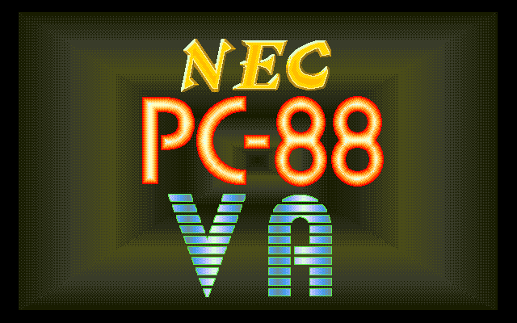
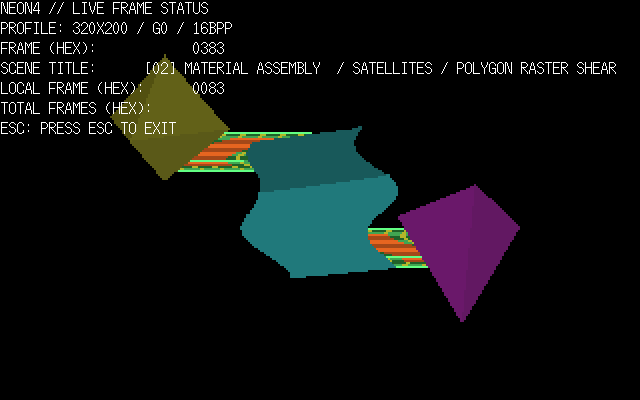
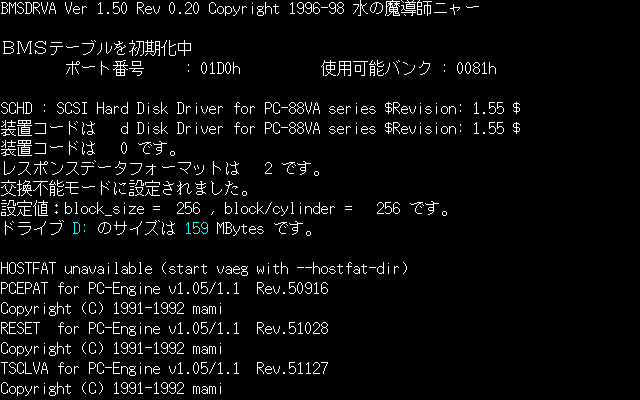
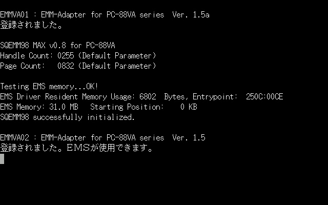
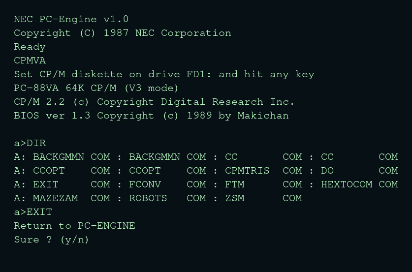
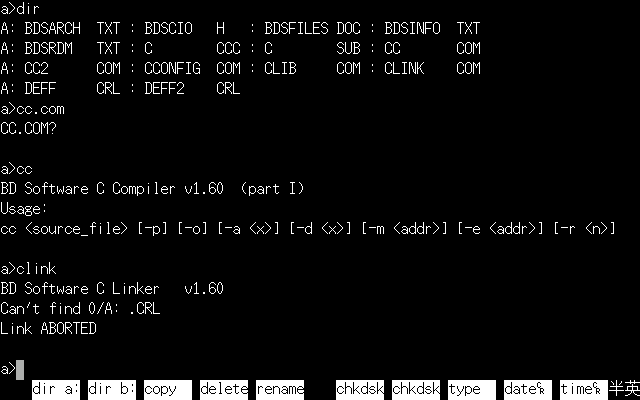
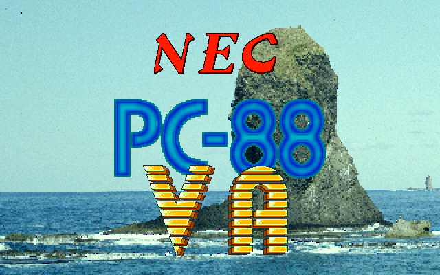

# 88VA Eternal Grafx

[](https://github.com/nakatamaho/vaeg/actions/workflows/build.yml)

88VA Eternal Grafx, or `vaeg`, is a maintained fork developed by Shinra from
the abandoned `project-vaeg` PC-88VA emulator lineage, itself derived from
Neko Project II. This fork is an actively maintained continuation of that
lineage, while the
[original project-vaeg repository](https://github.com/project-vaeg/vaeg)
remains a useful historical reference.



## Sections

| Section | Description |
| --- | --- |
| [Features](#features) | Portable platform support and major features |
| [News](#news) | Release notes and project updates |
| [Current Frontend](#current-frontend) | Portable SDL2 frontend overview |
| [ROM Dump](#rom-dump) | ROM names, checksums, and dump notes |
| [How to Make a Utility Disk or SASI HDD](#how-to-make-a-utility-disk-or-sasi-hdd) | Utility FDD and SASI image creation |
| [How to Read and Write Files on FDD and SASI HDD Images](#how-to-read-and-write-files-on-fdd-and-sasi-hdd-images) | Image file operations |
| [Demos](#demos) | Ready-to-use demo disk images |
| [Runtime Files and Saved State](#runtime-files-and-saved-state) | Configuration and saved-state paths |
| [Quick Build](#quick-build) | Short build commands |
| [PC-88VA Hardware Notes](#pc-88va-hardware-notes) | Emulated hardware summary |
| [Text Encoding Policy](#text-encoding-policy) | Source encoding rules |
| [Archived Reference Tier](#archived-reference-tier) | Historical source information |
| [Documentation Map](#documentation-map) | Guides and modernization notes |
| [Status](#status) | Current project status |
| [License Status](#license-status) | License and redistribution notes |

## Features

`vaeg` has the following features:

- builds and runs natively on modern Windows, Linux, and macOS systems;
- partial PC-9801-55-compatible SCSI support;
- EMS support;
- main-memory and BMS compatibility;
- host text copy and paste;
- more hardware-like sound through [ymfm](https://github.com/aaronsgiles/ymfm);
- Kana/Romaji input support;
- US keyboard layout support;
- more faithful uPD9002 instruction support, tested against the
  [SingleStepTests V20](https://github.com/SingleStepTests/v20) corpus;
- a uPD70008-compatible Z80 emulation path for `BRKEM`, using the
  pinned [MIT-licensed SuzukiPlan Z80 emulator](https://github.com/suzukiplan/z80);
  the former Z80 core with unclear licensing is no longer part of the active
  tree, and `BRKEM2` is not yet supported;
- optional on-screen graphics and text-sprite diagnostics;
- simple CRT screen effects;
- substantially reorganized and simplified code;
- a greatly reduced PC-98-only codebase.

## News

### 2026-08-30 - Rel.20260830

[Rel.20260830](https://github.com/nakatamaho/vaeg/releases/tag/rel-20260830)
focuses on VA implementation cleanup, compatibility hardening, and everyday
SDL frontend usability. It consolidates the native VA and SGP paths, refines
SCSI/BMS development-media workflows, and adds guest-only PNG screenshot
capture, selectable F12 actions, Pause, and menu/input polish. See
[Rel.20260830 changes](CHANGES.20260830.md) for the complete notes and the
current hardware-validation boundaries.



*NEON4 port for PC-88VA. The [original version](https://www.youtube.com/watch?v=X8b5w6losoY&list=PLJPzkZgJsiVs&index=5) ran on a higher-clocked system, so it is a little slower on PC-88VA.*

### 2026-08-14 - Rel.20260814

[Rel.20260814](https://github.com/nakatamaho/vaeg/releases/tag/rel-20260814)
adds reproducible CP/MVA/uPD70008 support, the configurable PC-88VA EMS
Board, native VA BMS defaults (16MB at `01D0H` with 640KB main RAM preserved),
and the EMMVA/SQEMM98/RDEMS development-disk workflow. It also includes SDL
keyboard and Windows JIS input fixes, host-drive selection, and 98-font and
effective-clock GUI diagnostics. Windows JIS keyboard mode can enter `_` from
the `ろ` key again. Release packages include matching
`HOSTFAT.SYS` and `SQEMM98.SYS` drivers with licenses, instructions, and
checksums. See [Rel.20260814 changes](CHANGES.20260814.md) for setup notes and
the current MSE `/B` limitation.



*Actual SDL-rendered VAEG capture: BMSDRV initializes at `01D0H` with `0081H`
usable BMS banks in the 16MB configuration, while SCHD detects the virtual
SCSI drive `D:` at 159MB of guest-usable capacity from the 160MB image.*



*Actual SDL-rendered VAEG capture: EMMVA and SQEMM98 initialize successfully
and report 31.0 MB of guest-usable EMS from the configured 32MB board.*

### 2026-08-06 - M76: uPD70008-compatible Z80 emulation and CP/MVA

M76 brings the uPD70008-compatible Z80 emulation path to a working state.
The pinned `suzukiplan/z80` backend now runs the CP/MVA path used by the
PC-88VA environment, while the compatibility layer remains separate from the
uPD780C FDD CPU path. CP/MVA reaches the CP/M `A>` prompt and can list and
exit from the generated tools disk.

See the [CP/MVA setup guide](docs/cpmva-setup.md) for the complete procedure.



*Actual SDL-rendered VAEG capture from a headless CP/MVA run: the generated
disk is mounted, `DIR` lists the CP/M tools, and `EXIT` returns to PC-Engine.*



### 2026-08-05 - Rel.260805

[Rel.260805](https://github.com/nakatamaho/vaeg/releases/tag/rel-260805)
adds the PC-9801-55-compatible SCSI workflow, two-target SCSI attachment,
SCSI/SASI file lifecycle checks, and the read-only `HOSTFAT.SYS` host-folder
drive. The release archive includes the matching `HOSTFAT.SYS`; the old
`HOSTDRV.SYS` name is not used.

User setup instructions: [SCSI support](docs/modernization/scsi-support.md),
[HOSTFAT](docs/modernization/hostfat.md), and the complete
[Rel.260805 changes](CHANGES.20260805.md).

### 2026-07-15 - Z80 compatibility migration

The active PC-88VA subsystem now uses the pinned MIT-licensed
`suzukiplan/z80` core through vaeg's BSD-2-Clause compatibility wrapper.
The shared Z80 compatibility backend serves both the uPD70008-compatible main
CPU mode and the uPD780C FDD subsystem. The independently authored
BSD-2-Clause disassembler is the production FDC disassembler. The former
M88/cisc-derived Z80 implementation has been removed from the current tree
after wrapper, conformance, state, differential, public, and private-system
gates; project history remains unchanged.

### 2026-07-13 - Rel.260713

[Rel.260713](https://github.com/nakatamaho/vaeg/releases/tag/rel-260713)
substantially improves everyday usability. Highlights include JIS physical
and US keytop keyboard modes, Roman-Kana input, host clipboard paste, relative
mouse input, disk-image and ZIP/7z/LZH drag and drop, blank D88/IMG creation,
SASI HDD controls, resizable display effects, and CPU/SGP speed and pacing
controls. Windows is distributed as a static single-file executable, with the
frontend font, startup image, and icon embedded.

**Important ROM upgrade note:** VA and VA2/VA3 now use separate model ROM
sets. VA keeps the unsuffixed names, while VA2/VA3 requires
`vadic_va2.rom`, `vafont_va2.rom`, `varom00_va2.rom`, `varom08_va2.rom`, and
`varom1_va2.rom`. VA2/VA3 does not fall back to the VA files, and the
`*_va2.rom` files have different contents and checksums; do not create them
by merely renaming the VA ROMs. See [CHANGES.20260713.md](CHANGES.20260713.md)
for the complete upgrade notes.

### 2026-07-08 - First portable release

[Rel.260708](https://github.com/nakatamaho/vaeg/releases/tag/rel-260708) was
the first release of the maintained portable fork. It established the active
CMake, SDL2, and Dear ImGui build for Windows-MinGW, Linux, and macOS after
completion of the phase-2 portability work.



## Current Frontend

The active frontend is the SDL2 + Dear ImGui build under `sdl2/`. It
targets:

- Windows via MSYS2 / MinGW-w64
- Linux via CMake, Ninja, SDL2, gcc or clang
- macOS release builds with pinned static SDL2, or development builds via
  MacPorts SDL2 under `/opt/local`

The executable is named `vaeg`.

```sh
vaeg [options]
```

Common user-facing command-line options are:

| Area | Option | Purpose |
| --- | --- | --- |
| Machine | `--model va` or `--model va2` | Select the VA or VA2/VA3 machine model |
| ROMs | `--roms PATH` | Use ROM files from an explicit directory |
| Sound | `--fmbackend np2` or `--fmbackend ymfm` | Select the FM sound backend |
| Sound | `--fmsound opn` or `--fmsound opna` | Select the VA sound hardware |
| Sound | `--samplerate RATE` | Select 11025, 22050, or 44100 Hz output |
| Sound | `--soundbuffer MS` | Set the sound buffer from 40 to 1000 ms |
| Sound | `--mute` | Start with sound muted |
| FDD | `--fdd1 PATH`, `--fdd2 PATH` | Mount a D88 or raw floppy image |
| SASI | `--sasi1 PATH`, `--sasi2 PATH` | Mount a SASI HDI image |
| HOSTFAT | `--hostfat-dir PATH` | Attach a read-only host folder to PC-Engine |
| Persistence | `--cfg PATH` or `--no-cfg` | Select or disable the configuration file |
| Persistence | `--bkupmem PATH` or `--no-bkupmem` | Select or disable backup memory |
| Execution | `--cpumult N` | Set CPU execution capacity from 1 to 32 |
| Execution | `--sgp VALUE` | Select SGP pacing: `model`, `follow-cpu`, or 1 to 16 |
| Execution | `--nowait` | Disable host wait/pacing |
| Execution | `--frameskip VALUE` | Select `auto`, `full`, 2, 3, or 4 frame skip |
| Display | `--fullscreen` or `--windowed` | Select the window mode |
| Display | `--effect VALUE` | Select the display effect |
| Display | `--scaling VALUE` | Select the display scaling mode |
| Input | `--controller joystick` or `--controller mouse` | Select the controller type |
| Input | `--keyboard-layout VALUE` | Select `jis`, `us`, or `custom` keyboard mapping |
| Information | `--help` or `--version` | Show usage or version information |

Use `none` as a media value to make that slot empty for the session. Positional
FDD image arguments are no longer accepted. Run `vaeg --help` or see the
[SDL2 frontend command-line reference](sdl2/README.md#command-line-options) for
diagnostic and advanced options.

These overrides are session-only: they are applied after loading `vaeg.cfg`
and do not replace saved settings unless the setting is changed through the
GUI during the run. Invalid combinations such as `--model va2 --fmsound opn`
fail before video, audio, and machine initialization. SASI options also verify
that the image is recognized as a complete, usable SASI disk rather than
merely checking that it exists.
`--smoke` runs a short headless initialization check and `--pacelog` prints
emulation pacing counters for timing diagnosis. See
[sdl2/README.md](sdl2/README.md#command-line-options) for details.

## ROM Dump

Machine ROM images, guest font ROMs, optional mechanical sound WAV files,
and operating system disks are not provided by this repository. ROMs must
be extracted from hardware you own. Tools such as `getromva` are included in
`VAEGTOOL070422.LZH`, available from the
[project-vaeg r080406 release](https://github.com/project-vaeg/vaeg/releases/tag/r080406).
Use that tool or an equivalent hardware dump tool to read the ROMs; do not
create a ROM set by renaming files or by copying ROM bytes from this source
tree. The dump timing/read caveats and the recorded size, CRC32, SHA-1, and
bank-reference checks are documented in [VA ROM dump notes](docs/modernization/va-rom-dump-notes.md).
The host GUI font source is under `assets/` and is embedded into every active
executable at build time.

Place ROMs beside `vaeg` or `vaeg.exe`:

```text
vaeg distribution root/
  vaeg[.exe]
  vadic.rom                 VA
  vafont.rom
  varom00.rom
  varom08.rom
  varom1.rom
  vadic_va2.rom             VA2/VA3
  vafont_va2.rom
  varom00_va2.rom
  varom08_va2.rom
  varom1_va2.rom
  vasubsys.rom              extra FDD subsystem ROM
```

The VA2/VA3 names match MAME's `pc88va2` ROM set in
`src/mame/nec/pc88va.cpp`; VA2 never falls back to the unsuffixed VA names.
`vasubsys.rom` remains a vaeg extra because vaeg runs the uPD780C FDD
subsystem that MAME currently leaves unconnected.
The frontend checks the executable directory first, then the current working
directory as a development fallback.
ROM files are intentionally absent from source and
binary artifacts. At startup, size, CRC32, and SHA-1 are checked against the
recorded VAEG ROM identities, including MAME-derived identities for the
ordinary ROMs and MAME's disabled `vasubsys.rom` declaration. VA1
`varom00.rom` uses the selected local readback reference; if its full SHA-1
differs, VAEG also reports which populated banks 0 through 5 differ and points
to the dump notes. Differences produce warnings but do not prevent startup.

## How to Make a Utility Disk or SASI HDD

PC-88VA software and utilities such as MSE, PCEPAT, BMS, and EMS are difficult
to obtain, inconvenient to update, and often have unclear licensing. Many
useful tools are also not self-contained: they require entries in
`CONFIG.SYS` to install drivers or memory managers, and some components must
be compiled locally, including EMS and read-only HOSTFAT support. To make
setup practical, vaeg provides scripts that assemble a local PC-88VA utility
environment from verified public inputs and build the components required for
local use.

Provide a commercial, bootable PC-Engine disk that you own (or its D88 image)
and an internet connection. The builders download the required utility
packages, verify their pinned checksums, and create an untracked utility
disk or SASI HDD image. Inputs are shared through
`~/.cache/vaeg/auto-generated-pc88va-utility-media/`.

To make a bootable utility D88:

```sh
tools/pc88va/build-utility-disk.sh \
  --source /path/to/your-pc-engine-boot-disk.d88 \
  --output /path/to/pc88va-development.d88
```

To make VA and VA2 SASI HDD images:

```sh
tools/pc88va/build-sasi-development-disks.sh \
  --source-va /path/to/your-va-pc-engine-boot-disk.d88 \
  --source-va2 /path/to/your-va2-pc-engine-boot-disk.d88 \
  --output-dir /path/to/pc88va-sasi
```

## How to Read and Write Files on FDD and SASI HDD Images

The Python image tools read the supplied disk images and write new images;
they never modify the source media in place.

To inspect and write files to a PC-Engine FDD/D88, prepare a payload directory
and install it into a new data image:

```sh
mkdir -p /private/tmp/vaeg-fdd-payload/root
cp /path/to/README.TXT /private/tmp/vaeg-fdd-payload/root/README.TXT

python3 tools/pc88va/pcengine_disk.py list \
  --image /path/to/your-pc-engine-boot-disk.d88
python3 tools/pc88va/pcengine_disk.py data \
  --source /path/to/your-pc-engine-boot-disk.d88 \
  --output /private/tmp/vaeg-fdd-write-test.d88
python3 tools/pc88va/pcengine_disk.py install \
  --image /private/tmp/vaeg-fdd-write-test.d88 \
  --payload /private/tmp/vaeg-fdd-payload
python3 tools/pc88va/pcengine_disk.py list \
  --image /private/tmp/vaeg-fdd-write-test.d88
```

To write files to a SASI HDD/HDI, stage them under their guest DOS
directories and build a new HDI from the matching PC-Engine source disk:

```sh
mkdir -p /private/tmp/vaeg-sasi-payload/BIN
cp /path/to/README.TXT /private/tmp/vaeg-sasi-payload/BIN/README.TXT

python3 tools/pc88va/build-sasi-development-disk.py \
  --variant va2 \
  --source /path/to/your-pc-engine-1.1-boot-disk.d88 \
  --supplemental-tree /private/tmp/vaeg-sasi-payload \
  --output /private/tmp/vaeg-sasi-write-test.hdi
```

Read the files back by mounting the resulting image in VAEG, then use guest
DOS commands. FDD1/FDD2 appear as `A:`/`B:` and SASI1/SASI2 normally appear as
`C:`/`D:`:

```dos
A>DIR B:
A>TYPE B:\README.TXT
A>DIR C:\BIN
A>TYPE C:\BIN\README.TXT
A>COPY C:\BIN\README.TXT B:\COPY.TXT
```

Compare a copied file with the original on the host. Keep source images and
generated media outside Git.

See [Auto-generated PC-88VA Utility Media](docs/modernization/pc88va-utility-media.md)
for supported inputs and the complete media layout. The scripts do not
redistribute ROMs or the source boot disk; review the terms of each package
before using or sharing the generated media.

## Demos

Several PC-88VA demo disks are available as non-bootable data images. The
[demo disk index](demos/disks/README.md) documents the collection and the
local bootable-disk workflow.

- [All demos](demos/disks/all-demos.d88.xz)
- [Glass Orbit](demos/disks/glass-orbit.d88.xz)
- [NEON3](demos/disks/neon3-distribution.d88.xz)
- [NEON4](demos/disks/neon4-distribution.d88.xz)
- [SGP pseudo-sprite](demos/disks/sgp-pseudo-sprite.d88.xz)
- [SGP wireframe](demos/disks/sgp-wireframe.d88.xz)
- [Zundamon Orbit](demos/disks/zundamon-orbit.d88.xz)

## Runtime Files and Saved State

The portable frontend stores writable runtime files in two locations. The
configuration and VA backup-memory files use the current working directory by
default:

- Current working directory: `vaeg.cfg`, `vabkupmem.dat`, and
  `va2bkupmem.dat`

GUI save-state slots and keyboard sidecars normally use the platform user
state directory:

- Linux: `$XDG_CONFIG_HOME/vaeg` or `$HOME/.config/vaeg`
- Windows: `%APPDATA%\vaeg`
- macOS: `~/Library/Application Support/vaeg`

For a portable setup, place `vaeg.cfg` and the applicable backup-memory file
beside the executable, or start vaeg from the directory containing them. The
`--cfg` and `--bkupmem` options can select explicit paths. GUI save-state
slots and keyboard sidecars remain in the platform user state directory.

Save-state files are local runtime artifacts. They are not portable
across architectures, compilers, or build families; do not move a state
file between 32-bit and 64-bit builds, between legacy and portable
builds, or between different host platforms and expect it to load.

For PC-88VA booting, `vaeg.cfg` should select the VA machine, its sound
hardware, and the VA clock domain:

```ini
pc_model=88VA1
SNDboard=100
clk_base=3993600
clk_mult=2
sgp_mode=0
sgp_mult=1
```

`SNDboard=100` selects the VA built-in YM2203/OPN. Use `SNDboard=200`
for a VA with Sound Board II, or with `pc_model=88VA2` for the built-in
YM2608/OPNA. Stale PC-98 defaults can halt at V2, leave the VA sound
hardware unbound, or select an invalid execution setting. CPU x2 is the
standard execution setting; x1-x32 changes V30 capacity while machine time,
sound, display, FDD, and RTC timing stay at standard speed. `sgp_mode` selects
Model default (0), Follow CPU (1), or Custom (2), with `sgp_mult=1..16` for
Custom. The GUI exposes
`Emulate -> Boot model -> VA / VA2/VA3`; changing the model selects its
default sound hardware (VA OPN, VA2/VA3 OPNA), selects the matching ROM
filename set, and resets the guest while retaining configured FDD and
SASI media. `Sound -> FM sound OPN/OPNA` can add Sound Board II to a VA.

## Quick Build

Detailed build instructions live in [BUILD.md](BUILD.md). The short
versions are:

```sh
# Linux
cmake --preset linux-release
cmake --build --preset linux-release
```

```sh
# Windows, from an MSYS2 MINGW64 shell
cmake --preset mingw-release
cmake --build --preset mingw-release
```

```sh
# macOS release (pinned static SDL2)
cmake --preset macos-release
cmake --build --preset macos-release
```

Linux-to-Windows cross-link checks are also available:

```sh
cmake --preset mingw-cross
cmake --build --preset mingw-cross
```

## PC-88VA Hardware Notes

The list below summarizes the PC-88VA hardware described by the PC-88VA
Technical Manual. The manual mainly describes the first PC-88VA; its
Music BIOS and ADPCM BIOS sections also cover VA2/VA3 and Sound Board II
behavior.

- Main CPU: uPD9002 at 8 MHz, with a uPD70008-compatible mode for V1/V2
  software. The manual describes V1/V2 compatibility timing relative to
  the older uPD780/Z80 software environment, but does not name a separate
  main CPU package.
- Disk subsystem CPU: uPD780C-compatible 4 MHz sub CPU with 8 KB ROM and
  16 KB RAM for intelligent FDD operation.
- Interrupt control: uPD8214-equivalent 8-level mode for V1/V2
  compatibility, and uPD8259-equivalent 13-level mode for V3 operation.
- DMA: four-channel priority DMA unit; channel 2 is assigned to the FDD
  interface, with channels 0 and 3 exposed to the bus slots.
- Timers: CPU internal timer/counter unit with uPD8253-compatible
  behavior; the counters are used for the general timer, BEEP frequency,
  and RS-232C baud generation. The FDD interface also has a motor-control
  timer, and the sound controller has its own timers.
- FDD controller: uPD765-compatible FDC for the internal 5-inch
  2HD/2D drives.
- Serial controller: uPD8251-compatible USART for RS-232C.
- Calendar clock: uPD4990/uPD4990AC-compatible battery-backed clock.
- Parallel/scanner/system ports: uPD8255-compatible parallel port
  interface appears in the scanner and system-port descriptions.
- Video system: SGP drawing processor, TSP/DPMC display composition,
  TVRAM, GVRAM, CGROM/CGRAM, 4096-color palette, sprite/text/graphics
  priority composition, and an optional video-board digitize path.
- Sound: the base sound controller is YM2203/OPN-class, providing three
  SSG voices and three FM voices, alongside BEEP and port sound. VA2/VA3
  and VA Sound Board II Music BIOS support YM2608/OPNA, adding six-FM
  operation, rhythm functions, and extended channel control.
- Other I/O: intelligent keyboard interface, Centronics-compatible
  printer interface, mouse/joystick/tablet port, optional hard disk
  interface, two general PC-98-compatible expansion slots, and one
  dedicated video-board slot.

## Text Encoding Policy

This fork has moved the source tree to modern UTF-8 text.

- Source files and documentation are UTF-8 without BOM.
- Line endings are LF throughout the current tree.
- Portable configuration files are UTF-8 only. Obsolete `np2.ini`,
  `np2.cfg`, and `vaeg.ini` files are not read by the active frontend.
- On Windows, the SDL2 frontend keeps paths as UTF-8 internally and
  converts them at the filesystem boundary to UTF-16.

This policy is about the repository and host frontend. It does not mean
the emulated guest machine is UTF-8; the PC-88VA and PC-98 software
environments keep their original character encodings and ROM behavior.

## Archived Reference Tier

M57 removed the former Win9x/VS2017 reference tier from the current tree.
Its exact G56 contents remain available at the annotated tag
[`archive/frozen-win9x-i286x-g56`](https://github.com/nakatamaho/vaeg/tree/archive/frozen-win9x-i286x-g56).
That archive contains the former `win9x/`, `i286x/`, `hlp/`, and
`cpuxva/memoryva.x86` paths. It remains useful for behavior archaeology,
including the G9 differential FDC and V30 DMA comparisons, but it is not a
current build target and has no CI compile guarantee.

Required lineage and license evidence is preserved in
[`LICENSES/legacy-vaeg.txt`](LICENSES/legacy-vaeg.txt), with its relationship
to the archived source documented in
[`docs/legal/legacy-source-provenance.md`](docs/legal/legacy-source-provenance.md).

## Documentation Map

- [BUILD.md](BUILD.md): current Windows, Linux, macOS build recipes.
- [sdl2/README.md](sdl2/README.md): SDL2 frontend runtime behavior.
- [docs/agents/ROADMAP.md](docs/agents/ROADMAP.md): modernization
  milestones and gate history.
- [docs/agents/CONVENTIONS.md](docs/agents/CONVENTIONS.md): repository
  invariants for contributors and agents.

## Status

The phase-2 portable tree is the path forward for Windows, Linux, and
macOS. The active build is CMake/C/SDL2/Dear ImGui. Historical comparison
uses the immutable archive tag described above.

## License Status

This is the current license map for the repository. It is a summary, not
a replacement for the original notices, source headers, and license files.

- Original emulator lineage: this fork is derived from project-vaeg and
  [Neko Project II (NP2)](http://www.retropc.net/yui/np2help.html).
  The preserved [`LICENSES/legacy-vaeg.txt`](LICENSES/legacy-vaeg.txt)
  records that vaeg follows the Neko
  Project II terms: "Neko Project II に準じます。" It also records the source
  license as: "ソースコードは 修正BSDライセンスとします。"
- Neko Project II attribution: `LICENSES/legacy-vaeg.txt` credits "Neko
  Project II (c) NP2 developer team, 1999-2001,2003,2004".
- Historical Z80 attribution: `LICENSES/legacy-vaeg.txt` records the PC-8801
  emulator M88 source used by the former implementation, credited as
  "M88 - PC8801 Series Emulator, Copyright (C) by cisc 1998, 2002." Those
  seven approved Z80 files are absent from current HEAD; this attribution and
  Git history are retained as historical evidence, not a relicensing claim.
- New phase-2 code and documentation by Nakata Maho are licensed under
  the 2-clause BSD license. New files carry the full notice in their file
  header; the required header template is in
  `docs/agents/CONVENTIONS.md`.
- Dear ImGui is vendored under `external/imgui/` and is licensed under
  the MIT license. See `external/imgui/LICENSE.txt` and
  `docs/agents/DECISIONS/ADR-0004-imgui-vendor.md`.
- ymfm is vendored from MAME's `3rdparty/ymfm` subtree under
  `external/ymfm/` and is licensed under the 3-clause BSD license. See
  `external/ymfm/LICENSE` and
  `docs/agents/DECISIONS/ADR-0009-opn-backend.md`.
- [suzukiplan/z80](https://github.com/suzukiplan/z80) is vendored under
  `external/suzukiplan-z80/` and is licensed under the MIT license. Its
  vaeg-required IRQ extension is reproduced from the approved downstream
  patch. The formerly used Z80 files with unclear licensing are absent from
  the active tree. See
  `external/suzukiplan-z80/LICENSE.txt`,
  `external/suzukiplan-z80/provenance.txt`, and
  `docs/agents/DECISIONS/ADR-0011-z80-migration.md`.
- The embedded host GUI font `assets/NotoSansJP-Regular.ttf` is licensed
  under the SIL Open Font License 1.1. See `assets/OFL.txt` and
  `assets/NOTICE.md`.
- Linux and MacPorts development builds use system SDL2. Windows and
  macOS release builds statically link pinned SDL2 2.32.10, which is
  zlib-licensed, as recorded in
  `docs/agents/DECISIONS/ADR-0006-sdl2-acquisition.md`.
- Machine ROM images, guest font ROMs, optional mechanical sound WAV
  files, and operating system disks are not distributed by this
  repository. They remain governed by their own rights and licenses.

When changing existing files, keep their existing notices intact. When
adding new files, use the 2-clause BSD header for Nakata Maho-authored
phase-2 work unless the file is third-party code or an explicitly
documented asset.
