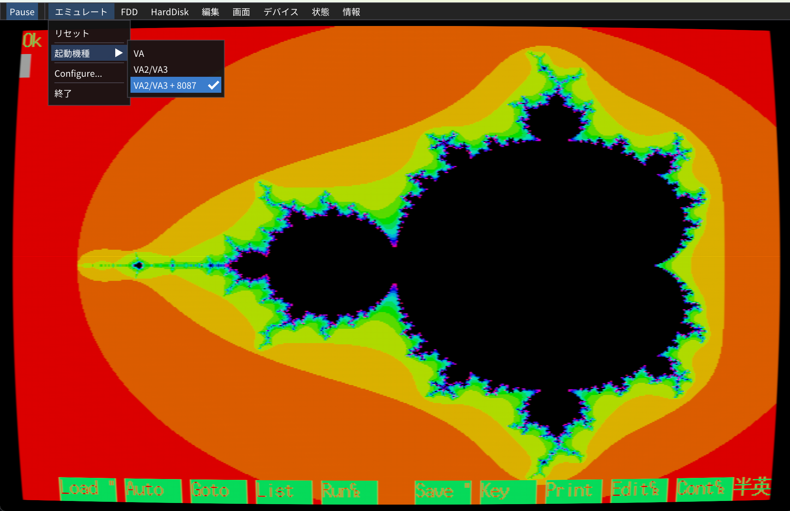

<!--
Copyright (c) 2026 Nakata Maho

Redistribution and use in source and binary forms, with or without
modification, are permitted provided that the following conditions are met:
1. Redistributions of source code must retain the above copyright notice,
   this list of conditions and the following disclaimer.
2. Redistributions in binary form must reproduce the above copyright notice,
   this list of conditions and the following disclaimer in the documentation
   and/or other materials provided with the distribution.

THIS SOFTWARE IS PROVIDED BY THE AUTHOR "AS IS" AND ANY EXPRESS OR
IMPLIED WARRANTIES, INCLUDING, BUT NOT LIMITED TO, THE IMPLIED WARRANTIES
OF MERCHANTABILITY AND FITNESS FOR A PARTICULAR PURPOSE ARE DISCLAIMED.
IN NO EVENT SHALL THE AUTHOR BE LIABLE FOR ANY DIRECT, INDIRECT,
INCIDENTAL, SPECIAL, EXEMPLARY, OR CONSEQUENTIAL DAMAGES (INCLUDING,
BUT NOT LIMITED TO, PROCUREMENT OF SUBSTITUTE GOODS OR SERVICES;
LOSS OF USE, DATA, OR PROFITS; OR BUSINESS INTERRUPTION) HOWEVER CAUSED AND
ON ANY THEORY OF LIABILITY, WHETHER IN CONTRACT, STRICT LIABILITY, OR TORT
(INCLUDING NEGLIGENCE OR OTHERWISE) ARISING IN ANY WAY OUT OF THE USE OF
THIS SOFTWARE, EVEN IF ADVISED OF THE POSSIBILITY OF SUCH DAMAGE.
-->

# Mandelbrot BASIC demo

`mandelbrot.bas` is an ASCII N88-日本語BASIC V3.1 program for the PC-88VA.
It renders a 640x400 Mandelbrot set in graphics mode 1, using 4096-colour
palette codes with 16 simultaneously displayed colours. Palette entries 1
through 15 are generated from HSV hues; entry 0 is black.

## Run

Copy `mandelbrot.bas` to the guest disk as `MANDELBROT.BAS`. On a VA2/VA3
profile with the optional 8087 enabled, start BASIC with `/87` and run:

```text
BASIC /87
LOAD "MANDELBROT.BAS",A
RUN
```

The same program also runs without the 8087:

```text
BASIC
LOAD "MANDELBROT.BAS",A
RUN
```

### Paste from the web

The ASCII source can also be entered without first copying it to the guest
disk. Open the raw `mandelbrot.bas` file in a web browser, press `Ctrl+A` and
`Ctrl+C`, then boot BASIC with `/87` in VAEG. In VAEG, choose **編集 → 貼り付け**
(**Edit → Paste**) to input the copied program automatically. When the paste
has finished, enter:

```text
RUN
```

The full image uses 32 iterations per pixel and can take a while in BASIC.
For a quick smoke run, edit line 240 from `MI=32` to `MI=16`.

## QA screenshot


