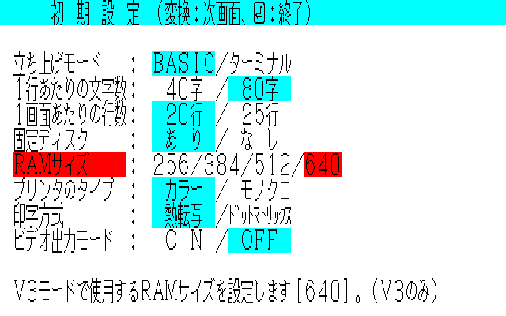
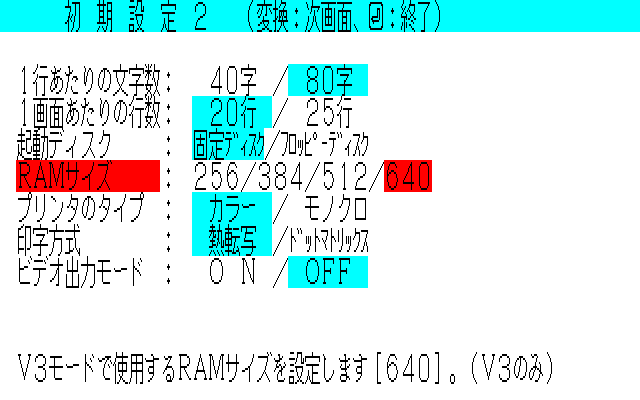

<!--
Copyright (c) 2026 Nakata Maho

Redistribution and use in source and binary forms, with or without
modification, are permitted provided that the following conditions
are met:
1. Redistributions of source code must retain the above copyright
   notice, this list of conditions and the following disclaimer.
2. Redistributions in binary form must reproduce the above copyright
   notice, this list of conditions and the following disclaimer in the
   documentation and/or other materials provided with the distribution.

THIS SOFTWARE IS PROVIDED BY THE AUTHOR "AS IS" AND ANY EXPRESS OR
IMPLIED WARRANTIES, INCLUDING, BUT NOT LIMITED TO, THE IMPLIED
WARRANTIES OF MERCHANTABILITY AND FITNESS FOR A PARTICULAR PURPOSE ARE
DISCLAIMED. IN NO EVENT SHALL THE AUTHOR BE LIABLE FOR ANY DIRECT,
INDIRECT, INCIDENTAL, SPECIAL, EXEMPLARY, OR CONSEQUENTIAL DAMAGES
(INCLUDING, BUT NOT LIMITED TO, PROCUREMENT OF SUBSTITUTE GOODS OR
SERVICES; LOSS OF USE, DATA, OR PROFITS; OR BUSINESS INTERRUPTION)
HOWEVER CAUSED AND ON ANY THEORY OF LIABILITY, WHETHER IN CONTRACT,
STRICT LIABILITY, OR TORT (INCLUDING NEGLIGENCE OR OTHERWISE) ARISING
IN ANY WAY OUT OF THE USE OF THIS SOFTWARE, EVEN IF ADVISED OF THE
POSSIBILITY OF SUCH DAMAGE.
-->
# PC-88VA Main RAM Options and BIOS Capacity Selection

## Hardware background

The VA and VA2 memory configuration described here has 256 KiB connected to
the main board. A further 256 KiB is installed in one CBUS slot, giving the
512 KiB configuration with which these machines were shipped.

To expand the machine to 640 KiB, the PC-88VA-01 256-KB RAM board is used. It
adds 128 KiB to the main memory and exposes the remaining 128 KiB as bank RAM.
The contemporary product description records the same arrangement: expansion
to 640 KB, with 128 KB usable as bank memory
([PC-88VA-01](http://pc88pc98.web.fc2.com/pc-8801etc/pc-88va-01.html)).

The 640-KiB main-memory address range is `00000h-9FFFFh` inclusive, with
`0A0000h` as the exclusive limit. The upper 128 KiB portion is therefore
`80000h-9FFFFh`; it is this range that is often described as the bank-RAM
portion in the 640-KiB expansion.

Commercial PC-9801 memory boards could also be used to provide a similar
expansion arrangement. The author has used approximately 1 MiB of such memory
as a RAM disk. That is historical hardware experience, not a claim that every
PC-9801 board has identical PC-88VA timing or decoding.

## Why the BIOS setting matters

Installing additional memory does not by itself make the operating system use
it. The BIOS memory-capacity setting must agree with the installed main-memory
size. With a 512-KiB installation, the BIOS must be changed to 640 KiB before
the operating system recognizes the upper 128 KiB. The BIOS also permits
smaller configurations such as 384 KiB and 256 KiB.

*VA main-memory configuration screen.*

*VA2 main-memory configuration screen.*

*On the original VA and VA2, hold the PC key while powering on, or press the
reset button, to open this configuration screen. When 640 KiB is installed,
the setting can be reduced from 640 KiB, but the operating system will not
recognize the memory above the selected capacity. The original default is
512 KiB; installing additional memory does not automatically change it to
640 KiB. Conversely, physically removing memory causes the BIOS to lower the
setting automatically to 512 KiB, 256 KiB, or the corresponding detected
capacity.*

The old VAEG behavior followed this hardware relationship: the emulator could
be configured with additional bank RAM while the BIOS capacity setting still
said 512 KiB. This was hardware-faithful, but it was easy to miss the BIOS
step and confusing when bank RAM was enabled.

## VAEG policy

The current VAEG tree keeps `Main_RAM` as an explicit configuration value. The
accepted capacities are 256, 384, 512, and 640 KiB, and the default is 640 KiB.
If the configuration contains an unsupported value, VAEG normalizes it to
640 KiB. The value controls the installed main-memory ceiling independently of
the `MEMswtch` BIOS work-area bytes.

When no saved VA backup-memory image exists, VAEG initializes the BIOS memory
capacity record from `Main_RAM`. Consequently, a new 640-KiB configuration
starts with a matching 640-KiB BIOS setting instead of silently retaining the
old 512-KiB assumption. An existing backup-memory image remains persistent;
this automatic initialization applies when that BIOS state has not yet been
saved.

This policy is intentional. It preserves the selectable 256/384/512-KiB
configurations while making the common expanded configuration self-consistent,
so enabling bank RAM does not require an easy-to-overlook second BIOS change.

Implementation references:

- [`NP2CFG.main_ram`](../../machine/pccore.h:56) stores the explicit capacity.
- [`pccore_normalize_mainram`](../../machine/pccore.c:110) accepts the four
  capacities and defaults invalid values to 640 KiB.
- [`Main_RAM`](../../sdl2/ini.c:337) is the configuration key, with validation
  in [`ini_read`](../../sdl2/ini.c:459).
- [`bkupmemva_initialize_mainram`](../../io/bkupmemva.c:50) seeds the BIOS
  capacity record when backup memory has no saved image.
